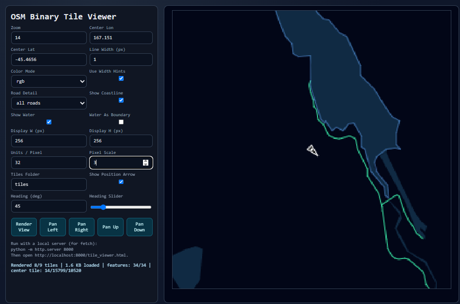

For this project I thought it would be neat to have a minimal, ultra-long battery life, and very small form factor, navigation device. 
Phones don't last forever and the thought of being stranded in an unknown area with a dead phone is very scary indeed. What if another device could be passively carried in a wallet or the pocket of a bag for years, drawing practically 0 quiescent current, and when needed provide minimal navigation for hours or days?

My first though was to store a large database of streetmaps and terrain data, then fetch and display the required streetmap data depending on the location of the device. This would require the location of the device obviously- and the only versatile option in that space is GNSS (ignoring WIFI MAC address databases etc). The other problem is navigational data- how do you store a meaningful amount of map on an embedded system, which often has storage constrained to hundreds of kilobytes? Cellular/network access is not guaranteed in situations that might neccessitate emergency navigation, which leaves storing map data locally. 

Streetmap data is available globally from openstreetmap in the PBF format. Effectively, this format defines ways using delta-encoded global coordinates (2xint64 per way point), and contains a large quantity of data not relevant to a navigational renderer application. This includes string names for each way, n number of flags or way specific variables, and metadata such as contributor ids.

This data can be extracted and formatted into a more compressed, embedded renderer friendly binary format. This is implemented in osm_to_tiles.py, which as the name suggests creates a set of map tiles from a single osm set. These tiles have a variable unsigned "extent" for example 4096=2^12=12 bits. Tiles can be extracted with variable size, for example 10km, with 0-extent defined points within that 10km. Each extracted point is local to the tile; with x/y between 0 and extent. Like PBF way points are assigned to a higher order way, which defines connected roads, pathways, or trails etc. A limited number of flags are extracted for rendering, such as "road" type ways being grouped into 2 bits of size class for rendering, with highways having the highest size value and trails etc. having the lowest. The binary format also supports closed polygons for displaying water features, with potential for displaying other area features (swamp? sand?)

It was necessary to be able to view the extracted binary files to determine the level of simplification that could be tolerated on embedded-type displays. This was accomplished using a vibe-coded web app.
This was beneficial as it allowed the rendering on embedded type displays to be previewed. IE. in TFT RGB or 2 bit grayscale as supported by some B/W epaper displays. Additionally, it displayed the total map binary loaded size to determine MCU resource usage.

Displaying all of Auckland CBD on a 256x256 display required loading 9 tiles with a total size of 213 KB. This roughly means that at the zoom level of 14 any map could be loaded into a high performance, low power, MCU SRAM, like a STM32U575. Because the maximum tile size at Auckland's very high detail level is ~40 KB, it also means that individual tiles could be loaded and rendered on commodity level MCUs. 

On the other side of the spectrum very sparse tiles still present the relevant details; like Deep Cove which displays the coverage of waterways and any roads present in the OSM dataset. This example only loads 1.6 KB total. 

Rendered in 4 grayscale the Auckland map is still usable, which suggests that a simple B/W EPD is sufficient for further developments.
